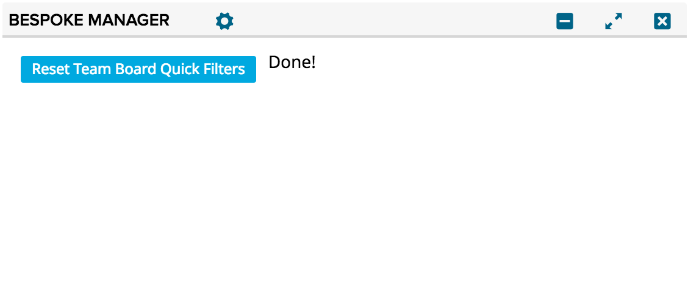

bespoke-manager
=========================

## Overview

This app helps manage your Bespoke preference for CA Agile Central. The primary use case is in working with Agile Central Support to address an issue where your Bespoke preferences have become invalid or corrupted.

Please let me know if you have more use cases for this tool to aid customer issues or streamline support.

## How to add this into CA Agile Central:

1. Create a new HTML custom app.

1.1 Settings gear in the top right of your dashboard -> Add app -> search for "html" -> click on the add button right below "Custom HTML"

2. Paste the HTML code from https://github.com/khalpin11/bespoke-app/raw/master/deploy/App.html into the HTML section of the new app which was just created at the bottom of your dashboard

3. Change title if desired (optional)

4. Press save

5. Now you can click the button to wipe your current fields and filters
